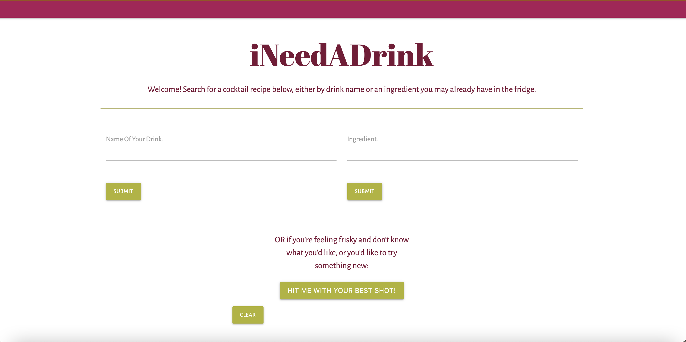
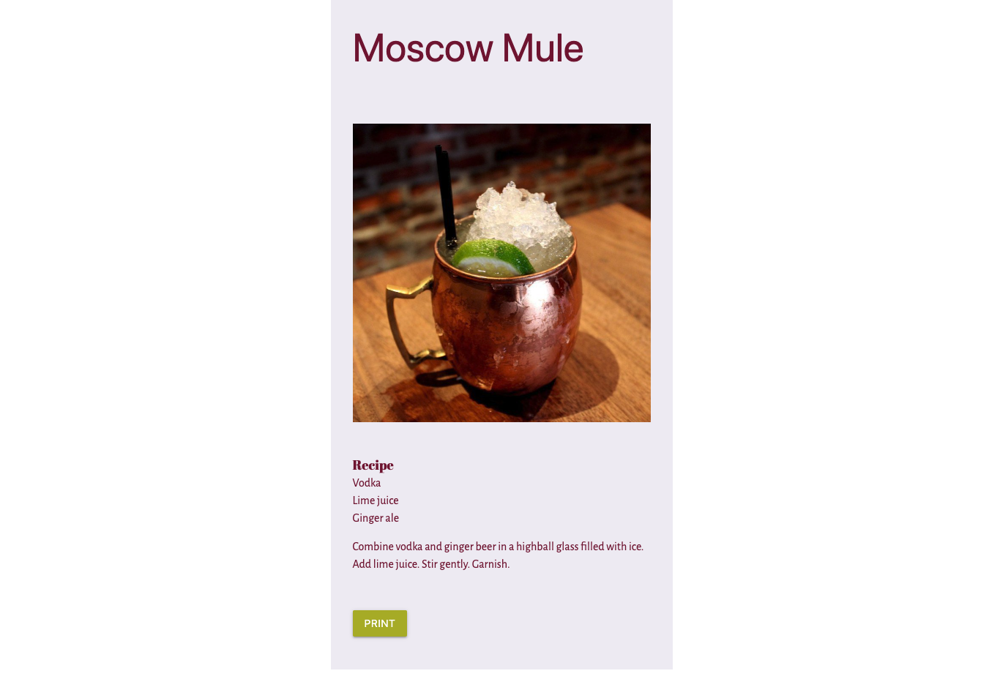
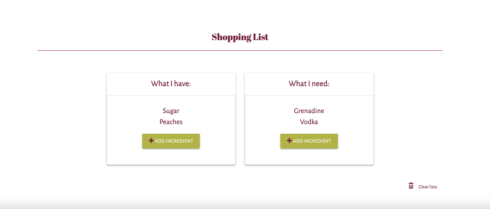

# iNeedaDrink

## Description

iNeedaDrink is an application created for the working adult (over the age of 21) who would like to make a cocktail and may not know where to start. This application can inspire new drink ideas, educate on more familiar drinks, and utilizes an editable shopping list to help make those tipsy dreams a reality.

* This repo is specifically for the updated version of the application where it has been converted from Vanilla Javascript to React by Charlie.
To see the original repo, please visit this [link](https://github.com/charliec1665/i-need-a-drink).

## Usage

1) The user can search for the name of drink they would like, or by an ingredient they may already have. There is also a "random" option that will randomly select a drink and recipe from a large API library.
 
 

 
 
 
2) A recipe card will appear with information based on the user's search. Just hit the clear button to start over, or simply search for another drink or ingredient.
 
 

 
 
 
3) Below the recipe card, the user can organize a shopping list. The shopping list has both a section to track what the user already may have in their fridge or pantry and what they will need to buy.
 
 

 

## Link
With iNeedADrink taking away the unknown, we encourage you to try out our application [here](https://charliec1665.github.io/i-need-a-drink-reactified).

## Credits

Search by Name Function: <a href="https://github.com/abilodeau21">Andy Bilodeau</a>

Search by Ingredient Function: <a href="https://github.com/qclaytor30">Quincy Claytor</a>

Random Cocktail Generator: <a href="https://github.com/hnihT212">Thinh Nguyen</a>

Shopping List & UI Design: <a href="https://github.com/charliec1665">Charlie Carter</a>

Icons: <a href="https://www.vecteezy.com/free-vector/wine">Wine Vectors by Vecteezy</a>